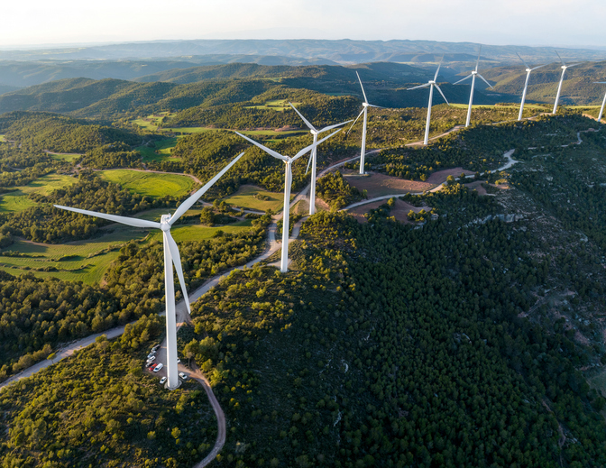
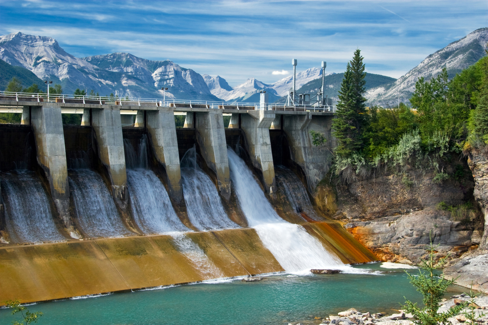

[Back to home](https://hoaninh-bb.github.io/Welcome-to-my-Portfolio/)

# What do I do?

- Field studies

- Reporting

- Proposal writing

- Project management

# Type of Projects

<table>
  <tr>
    <td> <em>Wind Farm</em></td>
    <td> <em>LNG</em></td>
  </tr>
  <tr>
    <td> <em>Hydropower</em></td>
    <td> <em>Hydrogen Energy</em></td>
  </tr>
</table>

# Writing Samples 
[Biodiversity Management Plan for a wind farm project (published for public by ADB)](https://www.adb.org/sites/default/files/project-documents/54211/54211-001-emp-en_40.pdf)

# List of projects
[View list of project](https://drive.google.com/file/d/1rX9Dyq_eUnq0e-ek_hX_r7RHxHPHx7bE/view?usp=sharing)

[Back to home](https://hoaninh-bb.github.io/Welcome-to-my-Portfolio/)

